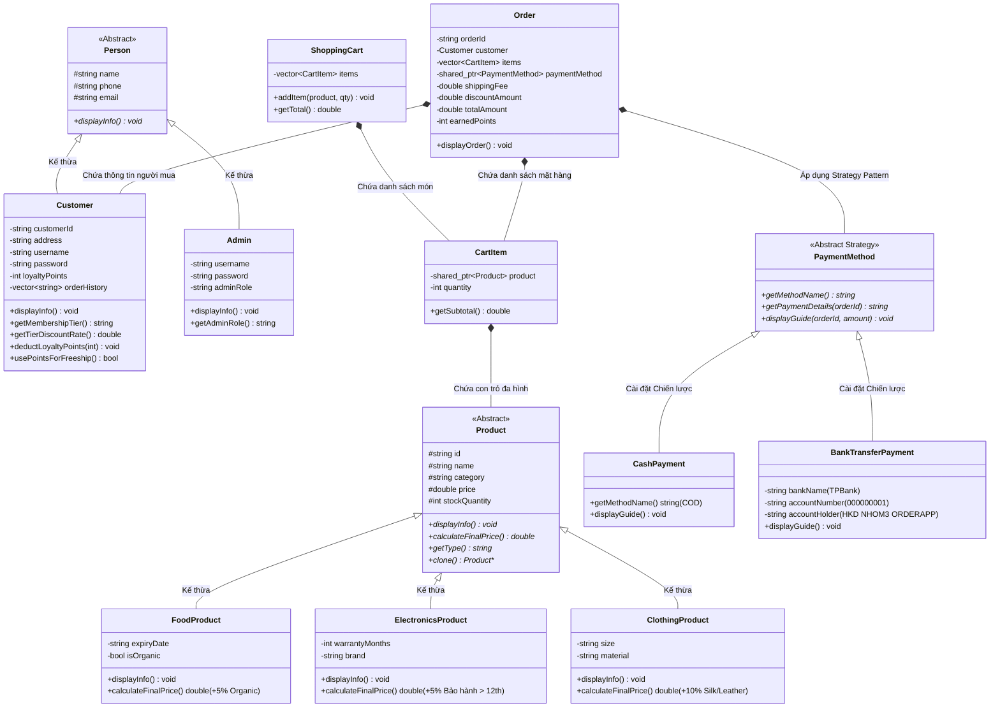

# 🛒 HỆ THỐNG ĐẶT HÀNG & QUẢN LÝ THƯƠNG MẠI ĐIỆN TỬ (OOP ORDERING APP)

> **Môn học:** Lập trình Hướng đối tượng (Object-Oriented Programming - OOP)  
> **Ngôn ngữ:** C++ (Chuẩn C++17)  
> **Nền tảng:** Console Application (Linux / Windows / macOS)  
> **Kiến trúc:** Phân tầng Hướng đối tượng & Áp dụng Design Patterns  

---

## 🏗️ 1. CẤU TRÚC DỰ ÁN & SƠ ĐỒ LỚP (OOP ARCHITECTURE)

### 📁 Cấu trúc thư mục mã nguồn:
```
oop final project/
├── app/                     # Controller Layer - Giao diện & Điều khiển luồng nghiệp vụ
│   ├── OrderingApp.h
│   └── OrderingApp.cpp
├── data/                    # Storage Layer - Lưu trữ tập tin dữ liệu vĩnh viễn
│   ├── products.txt         # Danh mục sản phẩm (FOOD, ELECTRONICS, CLOTHING)
│   ├── users.txt            # Danh sách tài khoản khách hàng & Điểm thưởng VIP
│   └── orders.txt           # Lịch sử toàn bộ đơn hàng & Hóa đơn toàn sàn
├── managers/                # Business & Utility Layer
│   ├── DataManager.h        # Template Generic Container với Lambda Filter/Sort/Find
│   ├── FileManager.h        # Static File I/O Engine (Đọc/Ghi dữ liệu vĩnh viễn)
│   └── FileManager.cpp
├── models/                  # Domain Models Layer
│   ├── cart/                # Quản lý giỏ hàng (CartItem, ShoppingCart)
│   │   ├── CartItem.h / .cpp
│   │   └── ShoppingCart.h / .cpp
│   ├── order/               # Quản lý hóa đơn & Địa chỉ giao hàng (Order)
│   │   └── Order.h / .cpp
│   ├── payment/             # Strategy Pattern - Phương thức thanh toán đa hình
│   │   └── PaymentMethod.h  # CashPayment (COD), BankTransferPayment (TPBank)
│   ├── person/              # Quản lý con người (Person, Customer, Admin)
│   │   ├── Person.h / .cpp
│   │   ├── Customer.h / .cpp
│   │   └── Admin.h / .cpp
│   └── products/            # Danh mục sản phẩm đa hình (Product, Food, Elec, Cloth)
│       ├── Product.h / .cpp
│       ├── FoodProduct.h / .cpp
│       ├── ElectronicsProduct.h / .cpp
│       └── ClothingProduct.h / .cpp
├── README.md                # Tài liệu tổng quan dự án
└── main.cpp                 # Điểm khởi chạy chương trình (Entry Point)
```

---

### 📊 Sơ đồ Phân cấp Kế thừa & Quan hệ Class (Class Diagram):



---

## ⚡ 2. CÁC TÍNH NĂNG NGHIỆP VỤ HỆ THỐNG (SYSTEM FEATURES)

Hệ thống cung cấp **2 Phân hệ Giao diện chuyên biệt**:

### 🛍️ A. PHÂN HỆ KHÁCH HÀNG (CUSTOMER PORTAL)
1. **Màn hình Chào mừng (Authentication Gateway):**
   * **Đăng nhập:** Xác thực tài khoản thành viên, tự động nạp phân hạng VIP và điểm tích lũy.
   * **Đăng ký:** Tạo tài khoản mới, tự động lưu vĩnh viễn vào `data/users.txt`.
   * **Khách vãng lai (Guest Mode):** Mua hàng nhanh mà không cần đăng ký tài khoản.
2. **Xem danh mục sản phẩm chuẩn hóa:** Bảng hiển thị căn lề đều cột (`std::setw`), in rõ Mã sản phẩm (`[MA SP]`), Đơn giá (`[DON GIA]`) và Số lượng tồn kho (`[TON KHO]`).
3. **Tìm kiếm sản phẩm linh hoạt:** Tìm kiếm theo từ khóa tên sản phẩm thông qua biểu thức Lambda và `DataManager::filter()`.
4. **Mua hàng hàng loạt theo lô (Batch Add):**
   * Nhập nhiều sản phẩm cùng lúc bằng dấu phẩy `,` (Ví dụ: `F01:2, E01:1, C01`).
   * Tự động bóc tách cú pháp (String Parsing), kiểm tra tồn kho độc lập cho từng món.
5. **Quản lý giỏ hàng thông minh:** Tự động cộng dồn số lượng khi mua món đã có trong giỏ, tính tổng tiền tức thì.
6. **Quy trình Đặt hàng & Thanh toán hiện đại:**
   * **Tự động nhận diện khu vực:** TPHCM/HN giao hỏa tốc **1 ngày (phí 10k)**; Tỉnh khác giao **3 ngày (phí 25k)**; Đơn $\ge 500k$ được **Miễn phí ship (0đ)**.
   * **Chiết khấu VIP:** Tự động giảm giá trực tiếp vào hóa đơn theo hạng: **Đồng (3%), Bạc (5%), Vàng (15%)**.
   * **Đổi Voucher Freeship:** Cho phép dùng **20.000 điểm tích lũy** để đổi 1 lần miễn phí giao hàng.
   * **Đa dạng thanh toán:** Chọn Tiền mặt khi nhận hàng (COD) hoặc Chuyển khoản TPBank (STK `000000001`, Nội dung `ORD-XXXX`).
   * **Tích điểm thưởng:** Mỗi 10.000 VND chi tiêu được cộng `+1.000 điểm` vào tài khoản.
7. **Hủy đơn hàng & Cơ chế Chống gian lận điểm (Anti-Fraud Rollback):**
   * Tự động cộng trả lại số lượng sản phẩm vào kho hàng (Restock).
   * Đơn COD hủy ngay lập tức; Đơn TPBank tiếp nhận và in biên lai **hoàn tiền trong 24H làm việc**.
   * **Thu hồi đúng số điểm thưởng đã cộng** từ đơn hủy và **hoàn lại 20.000 điểm voucher Freeship** vào tài khoản người dùng, đồng bộ ngay lập tức vào `data/users.txt`.
8. **Lịch sử đơn hàng cá nhân & Hồ sơ tài khoản:** Theo dõi danh sách đơn hàng đã mua và xem số dư điểm thưởng VIP.

---

### 👑 B. PHÂN HỆ QUẢN TRỊ VIÊN (ADMIN PORTAL)
1. **Quản lý Kho hàng (Inventory Management):**
   * Thêm sản phẩm mới (hỗ trợ nhập đầy đủ thuộc tính đặc thù của `FOOD`, `ELECTRONICS`, `CLOTHING`).
   * Cập nhật đơn giá bán và nhập thêm số lượng tồn kho (Restock).
   * Xóa sản phẩm khỏi danh mục (tự động đồng bộ và ghi đè vào `data/products.txt`).
2. **Quản lý Khách hàng (User Management):**
   * Xem danh sách toàn bộ tài khoản thành viên trong hệ thống.
   * Cấp / Trừ / Chỉnh sửa điểm thưởng VIP thủ công cho khách hàng (tự động cập nhật hạng thành viên và lưu vào `data/users.txt`).
   * Xóa tài khoản khách hàng vi phạm.
3. **Giám sát Đơn hàng Toàn Sàn (Order Supervision):**
   * Xem toàn bộ lịch sử đơn hàng của mọi khách hàng trong hệ thống.
   * Xem chi tiết từng hóa đơn theo mã `ORD-XXXX`.
   * Cập nhật trạng thái tiến độ đơn hàng (`Confirmed` $\rightarrow$ `Dang giao hang` $\rightarrow$ `Giao thanh cong` $\rightarrow$ `Cancelled`) và lưu vào `data/orders.txt`.
4. **Báo cáo Doanh thu & Xếp hạng Bán chạy (Analytics Dashboard):**
   * Thống kê Tổng doanh thu thực nhận toàn sàn (VND).
   * Thống kê tổng số đơn hàng, số đơn hợp lệ, số đơn đã hủy và tỷ lệ hủy đơn (%).
   * Phân tích doanh thu chi tiết theo từng ngành hàng (`FOOD`, `ELECTRONICS`, `CLOTHING`).
   * **Bảng xếp hạng Top 3 sản phẩm bán chạy nhất toàn sàn (Best-Sellers Ranking)**.

---

## 💎 3. CÁC NGUYÊN LÝ & KIẾN THỨC OOP ĐÃ ÁP DỤNG

| Nguyên lý OOP | Vị trí áp dụng trong dự án | Ý nghĩa & Bản chất kỹ thuật |
| :--- | :--- | :--- |
| **1. Tính Đóng Gói (Encapsulation)** | Toàn bộ các class (`Product`, `Customer`, `Admin`, `CartItem`, `Order`...) | Thuộc tính được bảo vệ tuyệt đối ở `private`/`protected`. Mọi thao tác truy xuất đều qua getter/setter có kiểm tra biên tính hợp lệ (`price >= 0`, `stock >= 0`, `points >= 0`, `qty > 0`). |
| **2. Tính Kế Thừa (Inheritance)** | - `Product` $\rightarrow$ `FoodProduct`, `ElectronicsProduct`, `ClothingProduct`<br>- `Person` $\rightarrow$ `Customer`, `Admin`<br>- `PaymentMethod` $\rightarrow$ `CashPayment`, `BankTransferPayment` | Lớp con kế thừa các thuộc tính/hành vi chung từ lớp cha, đồng thời mở rộng thêm các thuộc tính và công thức đặc thù. |
| **3. Tính Đa Hình (Polymorphism)** | `virtual double calculateFinalPrice() const = 0;`<br>`virtual void displayInfo() const = 0;`<br>`virtual void displayGuide(...) const = 0;` | Con trỏ lớp cha (`shared_ptr<Product>`, `shared_ptr<PaymentMethod>`) tự động gọi đúng phương thức tính giá và hiển thị của từng lớp con tương ứng tại thời điểm chạy (Dynamic Binding qua cơ chế Vtable/Vptr). |
| **4. Tính Trừu Tượng (Abstraction)** | `Product`, `Person`, `PaymentMethod` | Định nghĩa các lớp cơ sở trừu tượng chứa các hàm thuần ảo (`= 0`), đóng vai trò như bản thiết kế khung (Interface) chuẩn mực. |
| **5. Virtual Destructor** | `virtual ~Product() = default;`<br>`virtual ~Person() = default;`<br>`virtual ~PaymentMethod() = default;` | Đảm bảo khi giải phóng đối tượng lớp con thông qua con trỏ lớp cha, hàm hủy của lớp con luôn được thực thi trước $\rightarrow$ **Ngăn ngừa 100% rò rỉ bộ nhớ (Memory Leak)**. |
| **6. Lớp Mẫu (Generic Template)** | `DataManager<T>` trong `managers/DataManager.h` | Tái sử dụng mã nguồn 100%, cho phép quản lý tập hợp của bất kỳ kiểu dữ liệu `T` nào, hỗ trợ tìm kiếm và sắp xếp động bằng Lambda. |
| **7. Strategy Pattern** | `models/payment/PaymentMethod.h` | Tách biệt các thuật toán thanh toán (COD, TPBank) thành các lớp chiến lược độc lập, giúp hoán đổi phương thức thanh toán linh hoạt mà không cần sửa lớp `Order`. |
| **8. Nạp Chồng Toán Tử (Operator Overloading)** | `==`, `<`, `+=`, `[]`, `<<`, `>>` | So sánh sản phẩm theo ID (`==`), so sánh giá (`<`), thêm món vào giỏ (`+=`), truy xuất phần tử theo chỉ mục (`[]`), xuất/nhập luồng bảng dữ liệu (`<<`, `>>`). |
| **9. Nguyên Lý SOLID** | - **OCP (Open-Closed):** Mở rộng thêm sản phẩm/phương thức thanh toán mới mà không sửa mã nguồn lớp `Order`.<br>- **LSP (Liskov Substitution):** Các lớp con thay thế hoàn hảo cho lớp cha.<br>- **SRP (Single Responsibility):** Tách biệt rành mạch tầng Lưu trữ, tầng Quản lý, tầng Mô hình và tầng Giao diện. |

---

## 🧰 4. THƯ VIỆN CHUẨN C++ (STL - STANDARD TEMPLATE LIBRARY)

Dự án khai thác toàn diện các thành phần của thư viện chuẩn C++17:

1. **STL Containers (`<vector>`, `<map>`):**
   * `std::vector`: Lưu trữ danh sách phần tử trong `DataManager<T>`, `ShoppingCart`, `Order`, `Customer::orderHistory`, `users`.
   * `std::map`: Thống kê tần suất bán hàng và xếp hạng sản phẩm bán chạy nhất trong `adminViewAnalytics()`.
   * Sử dụng **Iterators** (`items.begin()`, `items.end()`) và `items.erase()` để xóa phần tử an toàn.
2. **Con trỏ thông minh (`<memory>`):**
   * `std::shared_ptr<Product>` và `std::shared_ptr<PaymentMethod>`: Quản lý vòng đời đối tượng đa hình trên Heap.
   * `std::make_shared<T>()`: Khởi tạo đối tượng an toàn theo cơ chế RAII, đếm tham chiếu (Reference Counting) tự động giải phóng vùng nhớ.
3. **Thuật toán STL & Functional (`<algorithm>`, `<functional>`):**
   * `std::sort`: Sắp xếp danh mục và sắp xếp bảng xếp hạng Top 3 bán chạy.
   * **Biểu thức Lambda (Lambda Expressions):** Tích hợp mệnh đề capture `[&keyword]` vào các hàm `filter()`, `find()`, `sort()`.
4. **Xử lý Chuỗi & Luồng Ký Tự (`<string>`, `<sstream>`):**
   * `std::string`: Quản lý chuỗi văn bản, sử dụng các phương thức `find()`, `substr()`, `find_first_not_of()`.
   * `std::stringstream`: Phân tích cú pháp (Parsing) tách chuỗi dấu phẩy `,` (Batch Add) và tách dấu gạch đứng `|` (Đọc file data).
   * Chuyển đổi kiểu: `std::stod()`, `std::stoi()`, `std::to_string()`.
5. **Luồng Đọc/Ghi Tập Tin (`<fstream>`):**
   * `std::ifstream`: Đọc dữ liệu từ `products.txt` và `users.txt`.
   * `std::ofstream`: Ghi nối tiếp `orders.txt` với cờ `std::ios::app`, ghi đè cập nhật `users.txt`, `products.txt`, `orders.txt` với cờ `std::ios::trunc`.
6. **Định dạng Xuất Luồng Console (`<iomanip>`):**
   * `std::setw(N)`: Cố định độ rộng cột bảng hiển thị.
   * `std::left`, `std::right`: Canh lề chữ và số tiền VND.
   * `std::fixed`, `std::setprecision(0)`: Hiển thị tiền số nguyên chuẩn, không bị in số mũ khoa học.
7. **Xử lý Thời Gian Thực Hệ Thống (`<ctime>`):**
   * `std::time_t`, `std::localtime`, `std::tm`: Lấy ngày giờ máy tính hiện tại.
   * `std::mktime`: Chuẩn hóa thời gian khi cộng dồn ngày giao (+1 ngày hỏa tốc, +3 ngày tiêu chuẩn) chống lỗi tràn ngày cuối tháng.
   * `std::strftime`: Định dạng chuỗi ngày `DD/MM/YYYY`.

---

## 🚀 5. HƯỚNG DẪN BIÊN DỊCH VÀ CHẠY ỨNG DỤNG

Bạn có thể biên dịch trực tiếp toàn bộ dự án bằng lệnh `g++` (chuẩn C++17):

### 🔹 1. Lệnh biên dịch trực tiếp:
```bash
g++ -std=c++17 -Wall -Wextra main.cpp models/products/*.cpp models/person/*.cpp models/cart/*.cpp models/order/*.cpp managers/*.cpp app/*.cpp -o ordering_app
```

### 🔹 2. Chạy chương trình:
```bash
./ordering_app
```

---

*© 2026 - OOP Final Project | Hệ Thống Đặt Hàng Trực Tuyến C++*
