# Ordering Application - OOP Final Project

Thiết kế chi tiết ứng dụng đặt hàng console C++ với đầy đủ các đặc tính OOP.

---

## 1. Sơ đồ kế thừa tổng quan

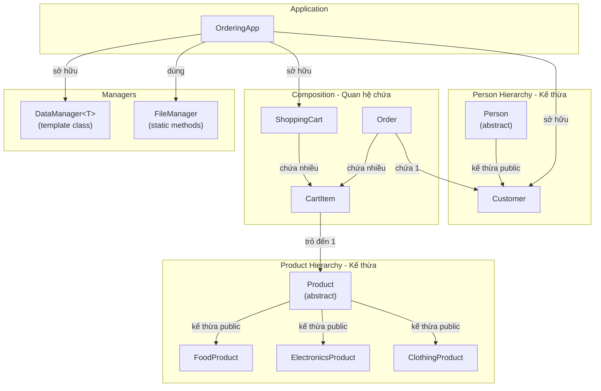

---

## 2. Sơ đồ quan hệ đầy đủ giữa tất cả Class

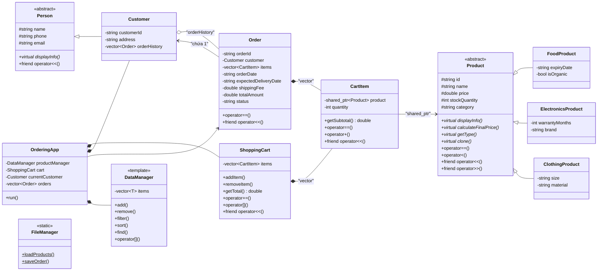

---

## 3. Chi tiết từng Class — Thuộc tính, Hàm & Chú thích

---

### 3.1 `Product` — Lớp cơ sở trừu tượng

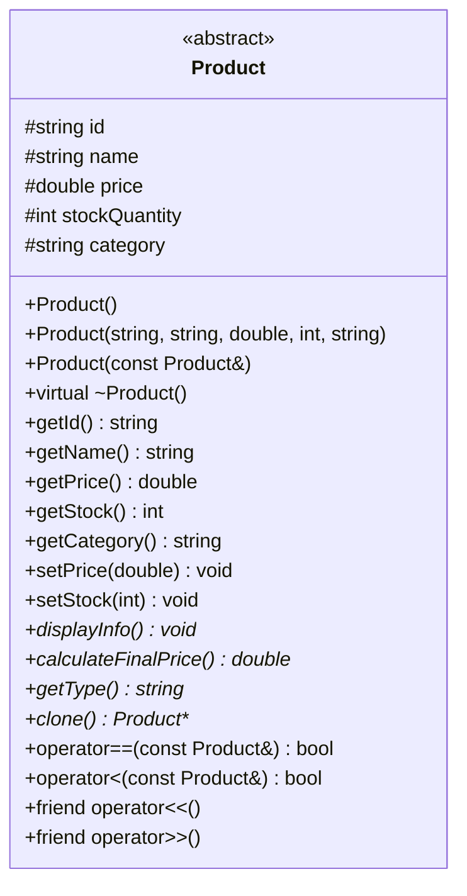

#### Thuộc tính (`protected`)

| Tên | Kiểu | Mô tả |
|:---|:---|:---|
| `id` | `string` | Mã sản phẩm duy nhất: "F01", "E01", "C01" |
| `name` | `string` | Tên sản phẩm: "Sua tuoi TH", "Tai nghe Sony" |
| `price` | `double` | Giá gốc (VND) |
| `stockQuantity` | `int` | Số lượng còn trong kho |
| `category` | `string` | Nhóm danh mục: "Food", "Electronics", "Clothing" |

#### Hàm

| Hàm | Loại OOP | Chú thích |
|:---|:---|:---|
| `Product()` | Default Constructor | Khởi tạo rỗng: id="", name="", price=0, stock=0, category="" |
| `Product(string, string, double, int, string)` | Parameterized Constructor | Khởi tạo đầy đủ thông tin qua danh sách khởi tạo (initializer list) |
| `Product(const Product& other)` | Copy Constructor | Sao chép toàn bộ thuộc tính từ đối tượng khác |
| `virtual ~Product()` | Virtual Destructor | Hủy an toàn khi xóa qua con trỏ lớp cha. Dùng `= default` |
| `getId() const` | Getter | Trả về mã SP. Có `const` vì không thay đổi đối tượng |
| `getName() const` | Getter | Trả về tên SP |
| `getPrice() const` | Getter | Trả về giá gốc |
| `getStock() const` | Getter | Trả về số lượng tồn kho |
| `getCategory() const` | Getter | Trả về danh mục |
| `setPrice(double p)` | Setter | Gán giá mới. **Có validate**: chỉ gán nếu `p >= 0` |
| `setStock(int q)` | Setter | Gán tồn kho mới. **Có validate**: chỉ gán nếu `q >= 0` |
| `displayInfo() const = 0` | Pure Virtual | **Bắt buộc lớp con override.** In thông tin SP ra console. Mỗi loại SP in khác nhau |
| `calculateFinalPrice() const = 0` | Pure Virtual | **Bắt buộc lớp con override.** Tính giá cuối sau thuế/phụ phí. Mỗi loại có công thức riêng |
| `getType() const = 0` | Pure Virtual | **Bắt buộc lớp con override.** Trả chuỗi loại SP: "FOOD"/"ELECTRONICS"/"CLOTHING". Dùng khi ghi file |
| `clone() const = 0` | Pure Virtual | **Bắt buộc lớp con override.** Tạo bản sao đúng kiểu thật (Prototype Pattern). Trả `new FoodProduct(*this)` |
| `operator==(const Product& other) const` | Operator Overloading | So sánh 2 SP theo `id`. Dùng khi tìm SP trong giỏ hàng |
| `operator<(const Product& other) const` | Operator Overloading | So sánh theo `price`. Dùng cho `std::sort` sắp xếp theo giá |
| `friend operator<<(ostream&, const Product&)` | Friend Function | In SP ra `ostream`: `cout << product`. Truy cập `private` nhờ `friend` |
| `friend operator>>(istream&, Product&)` | Friend Function | Đọc SP từ `istream`: `cin >> product`. Truy cập `private` nhờ `friend` |

---

### 3.2 `FoodProduct` — Kế thừa Product

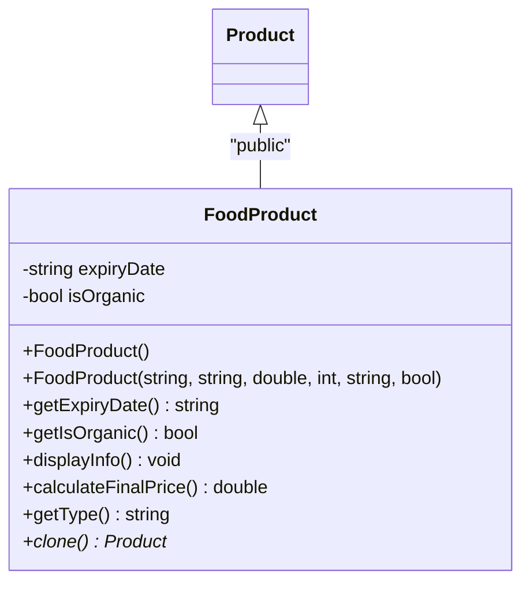

#### Thuộc tính riêng (`private`)

| Tên | Kiểu | Mô tả |
|:---|:---|:---|
| `expiryDate` | `string` | Hạn sử dụng, format: "2026-12-31" |
| `isOrganic` | `bool` | `true` = thực phẩm hữu cơ, `false` = thường |

#### Hàm

| Hàm | Chú thích |
|:---|:---|
| `FoodProduct()` | Default Constructor: gọi `Product()` + expiryDate="", isOrganic=false |
| `FoodProduct(string id, string name, double price, int stock, string expiry, bool organic)` | Parameterized Constructor: gọi `Product(id, name, price, stock, "Food")` + gán expiryDate, isOrganic |
| `getExpiryDate() const` | Getter: trả hạn sử dụng |
| `getIsOrganic() const` | Getter: trả trạng thái hữu cơ |
| `displayInfo() const override` | **Override:** In dạng `[FOOD] Sua TH | 32000 VND | HSD: 2026-12-31 | Huu co: Co` |
| `calculateFinalPrice() const override` | **Override:** Nếu `isOrganic == true` → `price × 1.05` (+5%), ngược lại → `price` |
| `getType() const override` | **Override:** Trả `"FOOD"` |
| `clone() const override` | **Override:** Trả `new FoodProduct(*this)` — tạo bản sao đúng kiểu FoodProduct |

---

### 3.3 `ElectronicsProduct` — Kế thừa Product

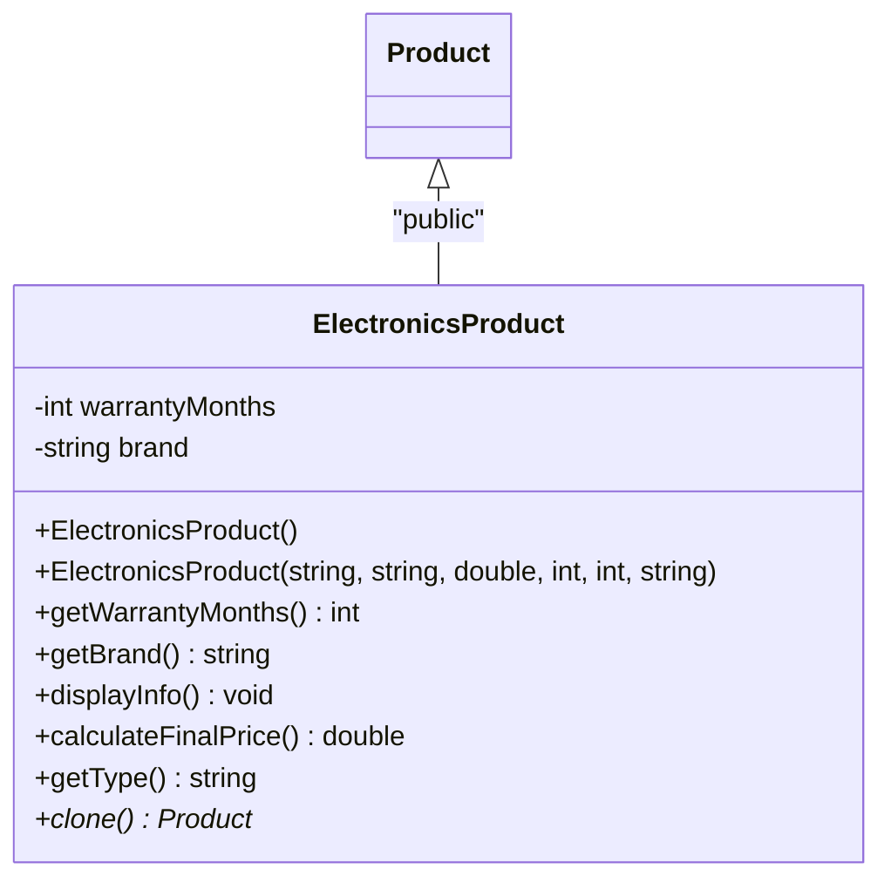

#### Thuộc tính riêng (`private`)

| Tên | Kiểu | Mô tả |
|:---|:---|:---|
| `warrantyMonths` | `int` | Số tháng bảo hành: 12, 24, 36,... |
| `brand` | `string` | Thương hiệu: "Sony", "Samsung", "Logitech" |

#### Hàm

| Hàm | Chú thích |
|:---|:---|
| `ElectronicsProduct()` | Default Constructor: gọi `Product()` + warrantyMonths=0, brand="" |
| `ElectronicsProduct(string id, string name, double price, int stock, int warranty, string brand)` | Parameterized Constructor: gọi `Product(id, name, price, stock, "Electronics")` + gán warranty, brand |
| `getWarrantyMonths() const` | Getter: trả số tháng bảo hành |
| `getBrand() const` | Getter: trả tên thương hiệu |
| `displayInfo() const override` | **Override:** In dạng `[ELECTRONICS] Tai nghe | 350000 VND | Brand: Sony | BH: 24 thang` |
| `calculateFinalPrice() const override` | **Override:** Nếu `warrantyMonths > 12` → `price × 1.05` (+5% phí BH dài hạn), ngược lại → `price` |
| `getType() const override` | **Override:** Trả `"ELECTRONICS"` |
| `clone() const override` | **Override:** Trả `new ElectronicsProduct(*this)` |

---

### 3.4 `ClothingProduct` — Kế thừa Product

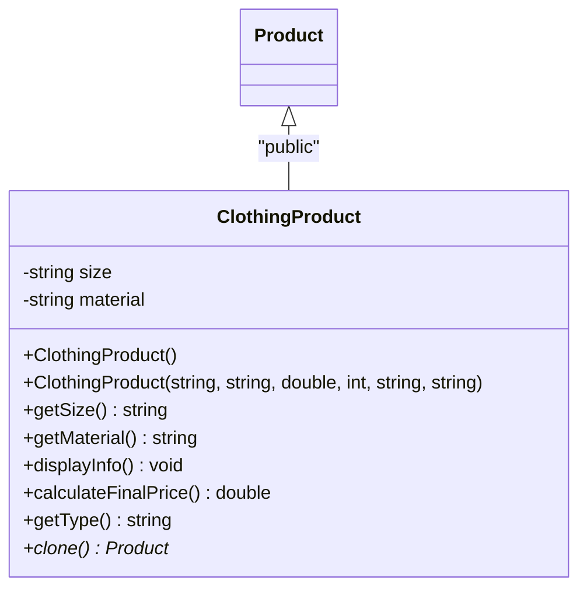

#### Thuộc tính riêng (`private`)

| Tên | Kiểu | Mô tả |
|:---|:---|:---|
| `size` | `string` | Kích cỡ: "S", "M", "L", "XL" |
| `material` | `string` | Chất liệu: "Cotton", "Silk", "Leather", "Polyester" |

#### Hàm

| Hàm | Chú thích |
|:---|:---|
| `ClothingProduct()` | Default Constructor: gọi `Product()` + size="", material="" |
| `ClothingProduct(string id, string name, double price, int stock, string size, string material)` | Parameterized Constructor: gọi `Product(id, name, price, stock, "Clothing")` + gán size, material |
| `getSize() const` | Getter: trả kích cỡ |
| `getMaterial() const` | Getter: trả chất liệu |
| `displayInfo() const override` | **Override:** In dạng `[CLOTHING] Ao thun | 150000 VND | Size: L | Chat lieu: Cotton` |
| `calculateFinalPrice() const override` | **Override:** Nếu material là `"Silk"` hoặc `"Leather"` → `price × 1.10` (+10% cao cấp), ngược lại → `price` |
| `getType() const override` | **Override:** Trả `"CLOTHING"` |
| `clone() const override` | **Override:** Trả `new ClothingProduct(*this)` |

---

### 3.5 `Person` — Lớp cơ sở trừu tượng

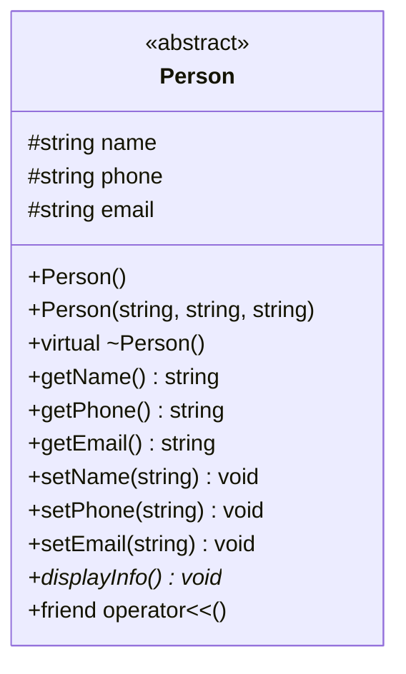

#### Thuộc tính (`protected`)

| Tên | Kiểu | Mô tả |
|:---|:---|:---|
| `name` | `string` | Họ tên đầy đủ |
| `phone` | `string` | Số điện thoại |
| `email` | `string` | Địa chỉ email |

#### Hàm

| Hàm | Chú thích |
|:---|:---|
| `Person()` | Default Constructor: name="", phone="", email="" |
| `Person(string name, string phone, string email)` | Parameterized Constructor: khởi tạo đầy đủ |
| `virtual ~Person()` | Virtual Destructor: hủy an toàn qua con trỏ lớp cha |
| `getName() const` | Getter: trả họ tên |
| `getPhone() const` | Getter: trả SĐT |
| `getEmail() const` | Getter: trả email |
| `setName(string)` | Setter: cập nhật tên |
| `setPhone(string)` | Setter: cập nhật SĐT |
| `setEmail(string)` | Setter: cập nhật email |
| `displayInfo() const = 0` | **Pure Virtual:** Bắt buộc lớp con override. In thông tin cá nhân |
| `friend operator<<(ostream&, const Person&)` | Friend: in Person ra `cout << person` |

---

### 3.6 `Customer` — Kế thừa Person

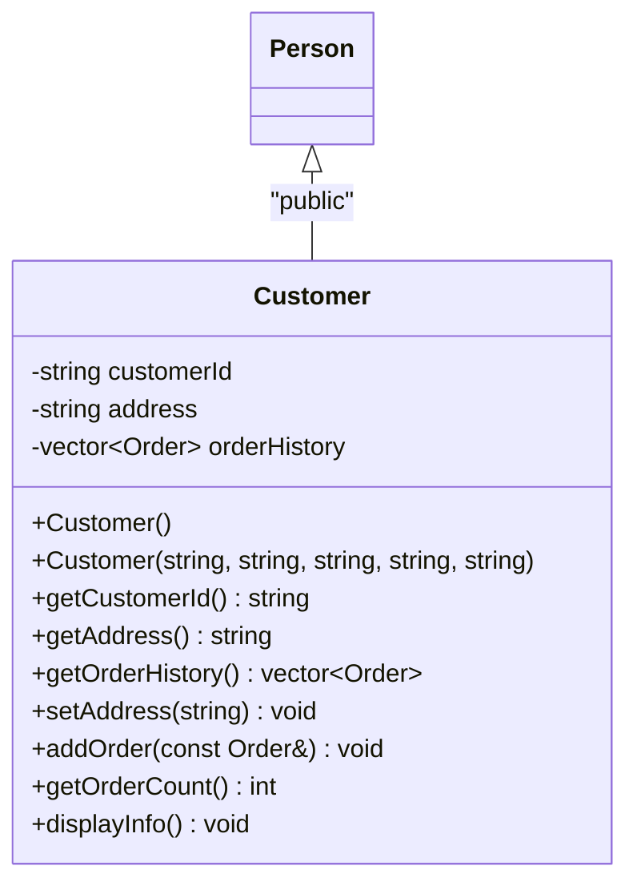

#### Thuộc tính riêng (`private`)

| Tên | Kiểu | Mô tả |
|:---|:---|:---|
| `customerId` | `string` | Mã khách hàng: "KH-001" |
| `address` | `string` | Địa chỉ giao hàng: "123 Le Loi, Q1, HCM" |
| `orderHistory` | `vector<Order>` | Danh sách các đơn hàng đã đặt (STL container) |

#### Hàm

| Hàm | Chú thích |
|:---|:---|
| `Customer()` | Default Constructor: gọi `Person()` + customerId="", address="" |
| `Customer(string id, string name, string phone, string email, string address)` | Parameterized Constructor: gọi `Person(name, phone, email)` + gán customerId, address |
| `getCustomerId() const` | Getter: trả mã KH |
| `getAddress() const` | Getter: trả địa chỉ giao hàng |
| `getOrderHistory() const` | Getter: trả toàn bộ lịch sử đơn hàng (vector) |
| `setAddress(string)` | Setter: cập nhật địa chỉ mới (mỗi lần đặt hàng có thể đổi) |
| `addOrder(const Order& order)` | Thêm 1 đơn hàng vào cuối `orderHistory` bằng `push_back` |
| `getOrderCount() const` | Trả `orderHistory.size()` — tổng số đơn đã đặt |
| `displayInfo() const override` | **Override:** In dạng `KH-001 | Nguyen Van A | 0901234567 | abc@email.com | 123 Le Loi` |

---

### 3.7 `CartItem` — Một dòng trong giỏ hàng

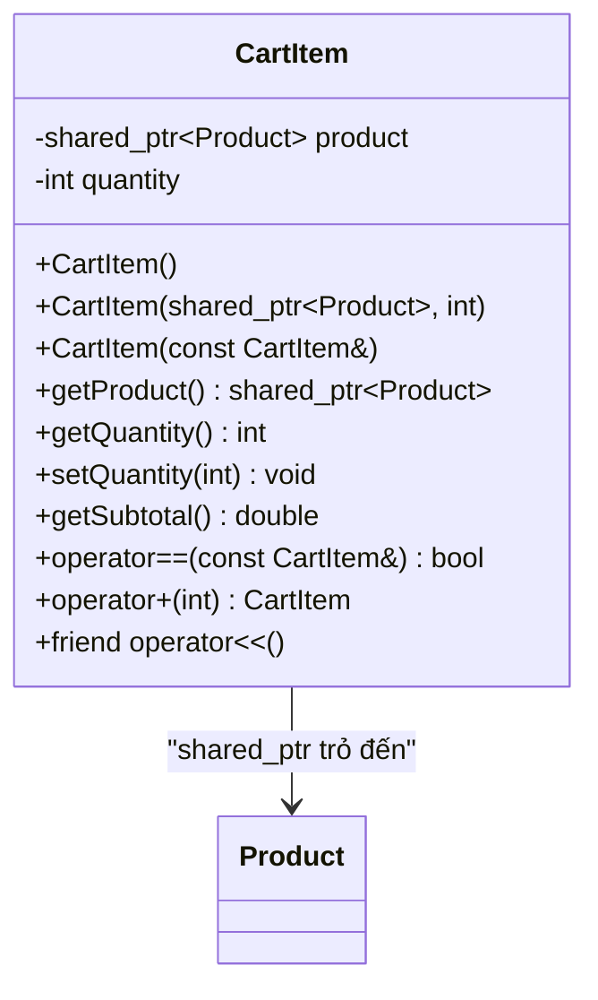

#### Thuộc tính (`private`)

| Tên | Kiểu | Mô tả |
|:---|:---|:---|
| `product` | `shared_ptr<Product>` | Con trỏ thông minh trỏ đến SP gốc (không copy SP, chỉ tham chiếu) |
| `quantity` | `int` | Số lượng khách chọn mua |

#### Hàm

| Hàm | Chú thích |
|:---|:---|
| `CartItem()` | Default Constructor: product=nullptr, quantity=0 |
| `CartItem(shared_ptr<Product> p, int qty)` | Parameterized Constructor: gán product và quantity |
| `CartItem(const CartItem& other)` | Copy Constructor: sao chép shared_ptr (cùng trỏ đến 1 SP) và quantity |
| `getProduct() const` | Getter: trả shared_ptr để truy cập thông tin SP (`getProduct()->getName()`) |
| `getQuantity() const` | Getter: trả số lượng |
| `setQuantity(int qty)` | Setter: cập nhật số lượng. **Validate**: chỉ gán nếu `qty > 0` |
| `getSubtotal() const` | Tính thành tiền = `quantity × product->calculateFinalPrice()`. **Đa hình ở đây**: gọi `calculateFinalPrice()` đúng loại SP thật |
| `operator==(const CartItem& other) const` | So sánh 2 CartItem theo `product->getId()`. Dùng khi kiểm tra SP đã có trong giỏ chưa |
| `operator+(int extraQty) const` | Trả CartItem mới với `quantity + extraQty`. Ví dụ: `item + 3` → tạo item mới có qty tăng thêm 3 |
| `friend operator<<(ostream&, const CartItem&)` | In dạng: `Sua TH | SL: 3 | Don gia: 33,600 | Thanh tien: 100,800` |

---

### 3.8 `ShoppingCart` — Giỏ hàng

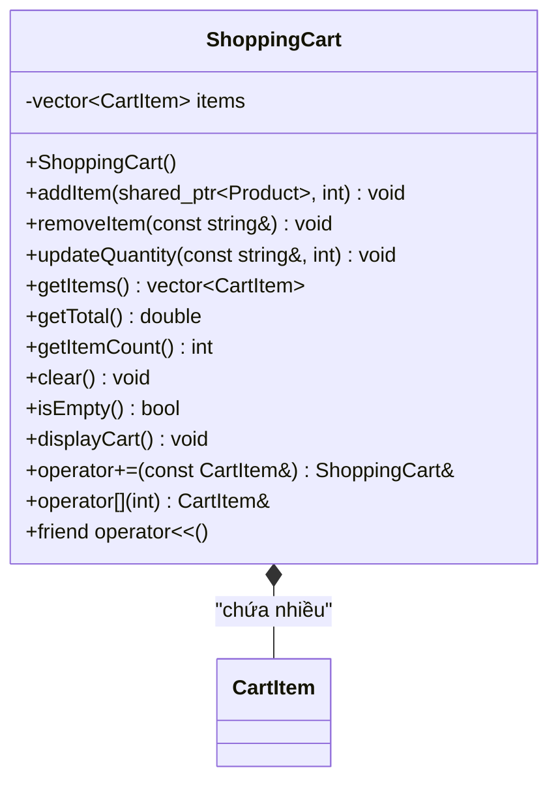

#### Thuộc tính (`private`)

| Tên | Kiểu | Mô tả |
|:---|:---|:---|
| `items` | `vector<CartItem>` | Danh sách các mục hàng trong giỏ |

#### Hàm

| Hàm | Chú thích |
|:---|:---|
| `ShoppingCart()` | Default Constructor: items rỗng |
| `addItem(shared_ptr<Product> product, int qty)` | **Logic chính:** Duyệt `items` → nếu tìm thấy SP cùng ID → tăng quantity. Nếu không → `push_back` CartItem mới. Đây là yêu cầu đề bài "users can add items multiple times" |
| `removeItem(const string& productId)` | Xóa CartItem có `product->getId() == productId`. Dùng `std::remove_if` + `erase` (erase-remove idiom) |
| `updateQuantity(const string& productId, int newQty)` | Tìm CartItem theo productId → gán quantity mới. Nếu `newQty <= 0` → xóa luôn item đó |
| `getItems() const` | Getter: trả `const vector<CartItem>&` để Order copy khi đặt hàng |
| `getTotal() const` | Tính tổng tiền = duyệt tất cả items, cộng dồn `item.getSubtotal()`. Trả `double` |
| `getItemCount() const` | Trả `items.size()` — số dòng trong giỏ (không phải tổng quantity) |
| `clear()` | Gọi `items.clear()` — xóa sạch giỏ sau khi đã đặt hàng thành công |
| `isEmpty() const` | Trả `items.empty()` — kiểm tra giỏ trống hay không. Dùng trước khi đặt hàng |
| `displayCart() const` | In toàn bộ giỏ: header → duyệt items gọi `cout << item` → tổng tiền cuối |
| `operator+=(const CartItem& item)` | Thêm item vào giỏ: `cart += CartItem(product, 2)`. Bên trong gọi `addItem()` |
| `operator[](int index)` | Truy cập CartItem theo vị trí: `cart[0]` → CartItem đầu tiên. Trả `CartItem&` |
| `friend operator<<(ostream&, const ShoppingCart&)` | In giỏ ra `cout << cart`. Gọi `displayCart()` bên trong |

---

### 3.9 `Order` — Đơn hàng

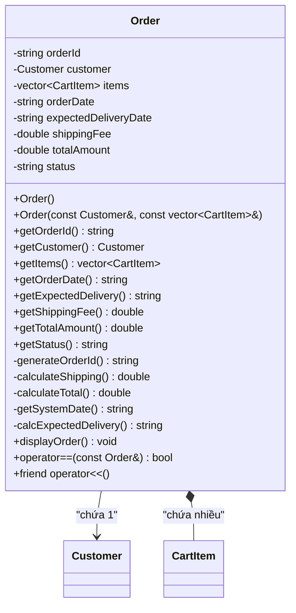

#### Thuộc tính (`private`)

| Tên | Kiểu | Mô tả |
|:---|:---|:---|
| `orderId` | `string` | Mã đơn tự tạo: "ORD-001", "ORD-002",... |
| `customer` | `Customer` | Thông tin người mua (copy từ Customer hiện tại) |
| `items` | `vector<CartItem>` | Danh sách SP đã đặt (copy từ giỏ hàng) |
| `orderDate` | `string` | Ngày đặt, lấy từ hệ thống: "25/08/2026" |
| `expectedDeliveryDate` | `string` | Ngày giao dự kiến: orderDate + 5 ngày |
| `shippingFee` | `double` | Phí ship (tính tự động theo logic) |
| `totalAmount` | `double` | Tổng thanh toán = Σ subtotal + shippingFee |
| `status` | `string` | Trạng thái đơn: "Confirmed" |

#### Hàm Public

| Hàm | Chú thích |
|:---|:---|
| `Order()` | Default Constructor: mọi thứ rỗng/0 |
| `Order(const Customer& cust, const vector<CartItem>& cartItems)` | **Constructor chính.** Nhận KH + danh sách item → tự động gọi: `generateOrderId()`, `getSystemDate()`, `calcExpectedDelivery()`, `calculateShipping()`, `calculateTotal()`. Gán `status = "Confirmed"` |
| `getOrderId() const` | Getter: trả mã đơn |
| `getCustomer() const` | Getter: trả thông tin KH |
| `getItems() const` | Getter: trả danh sách SP đã đặt |
| `getOrderDate() const` | Getter: trả ngày đặt |
| `getExpectedDelivery() const` | Getter: trả ngày giao dự kiến |
| `getShippingFee() const` | Getter: trả phí ship |
| `getTotalAmount() const` | Getter: trả tổng thanh toán |
| `getStatus() const` | Getter: trả trạng thái |
| `displayOrder() const` | In hóa đơn đầy đủ: mã đơn, ngày, KH, địa chỉ, danh sách SP, phí ship, tổng tiền |
| `operator==(const Order& other) const` | So sánh 2 đơn theo `orderId`. Dùng khi tìm kiếm đơn hàng |
| `friend operator<<(ostream&, const Order&)` | In đơn hàng ra `cout << order`. Gọi `displayOrder()` bên trong |

#### Hàm Private (helper)

| Hàm | Chú thích |
|:---|:---|
| `generateOrderId()` | Tạo mã tự tăng: dùng biến `static int counter` → `"ORD-" + to_string(++counter)`. Trả `string` |
| `getSystemDate()` | Lấy ngày hiện tại từ hệ thống: dùng `std::time()` + `std::localtime()` + `std::strftime()`. Trả format `"dd/mm/yyyy"` |
| `calcExpectedDelivery()` | Lấy ngày hệ thống + thêm 5 ngày (dùng `std::mktime` cộng thêm `5*24*3600` giây). Trả format `"dd/mm/yyyy"` |
| `calculateShipping()` | Tính phí ship: nếu tổng hàng > 500,000 → miễn phí, ngược lại → 30,000 VND. Trả `double` |
| `calculateTotal()` | Duyệt `items`, cộng dồn `item.getSubtotal()` + `shippingFee`. Trả `double` |

---

### 3.10 `DataManager<T>` — Template Class quản lý tổng quát

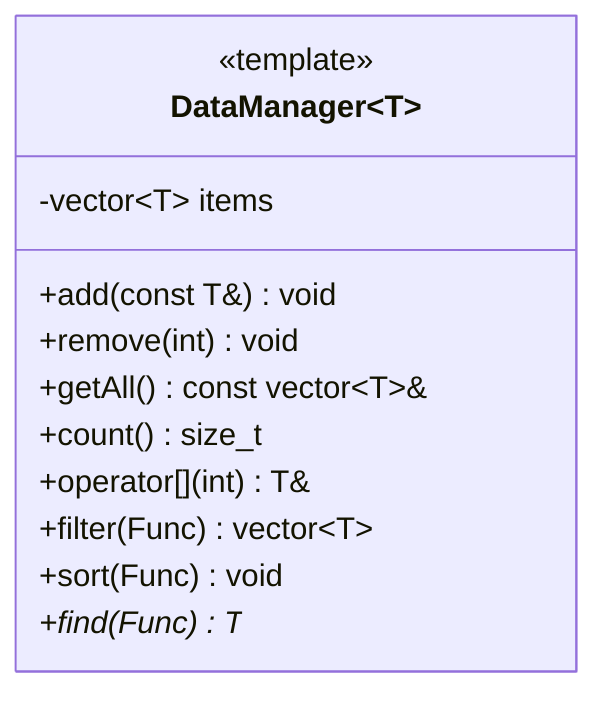

#### Thuộc tính (`private`)

| Tên | Kiểu | Mô tả |
|:---|:---|:---|
| `items` | `vector<T>` | Danh sách phần tử kiểu T. Khi dùng `DataManager<shared_ptr<Product>>` → thành `vector<shared_ptr<Product>>` |

#### Hàm

| Hàm | Chú thích |
|:---|:---|
| `add(const T& item)` | Thêm phần tử vào cuối: `items.push_back(item)` |
| `remove(int index)` | Xóa phần tử tại vị trí index. Kiểm tra `index >= 0 && index < items.size()` trước khi xóa |
| `getAll() const` | Trả `const vector<T>&` — tham chiếu hằng, không copy, dùng để duyệt |
| `count() const` | Trả `items.size()` — tổng số phần tử |
| `operator[](int index)` | Truy cập theo index: `manager[0]`. Trả `T&` (tham chiếu, có thể chỉnh sửa) |
| `filter(Func condition)` | **Template function lồng.** Nhận lambda làm điều kiện → duyệt items → trả `vector<T>` chứa các phần tử thỏa điều kiện |
| `sort(Func comparator)` | **Template function lồng.** Nhận lambda so sánh → gọi `std::sort(items.begin(), items.end(), comparator)` |
| `find(Func condition)` | **Template function lồng.** Nhận lambda → duyệt tìm phần tử đầu tiên thỏa → trả `T*` (con trỏ) hoặc `nullptr` nếu không tìm thấy |

---

### 3.11 `FileManager` — Đọc/ghi file

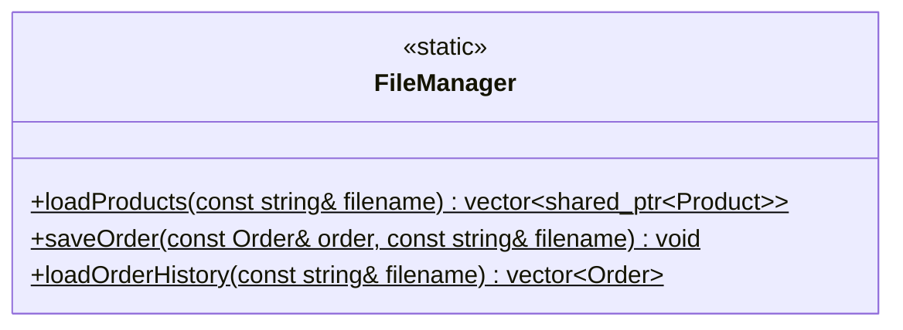

> Không có thuộc tính — chỉ chứa hàm `static`.

#### Hàm

| Hàm | Chú thích |
|:---|:---|
| `static loadProducts(const string& filename)` | Mở file bằng `ifstream` → đọc từng dòng → tách theo `\|` → dựa vào field TYPE tạo `make_shared<FoodProduct/ElectronicsProduct/ClothingProduct>(...)` → push vào vector → trả về. Nếu file không mở được → in lỗi, trả vector rỗng |
| `static saveOrder(const Order& order, const string& filename)` | Mở file bằng `ofstream` (append mode) → ghi toàn bộ thông tin đơn hàng: mã, ngày, KH, SP, phí ship, tổng tiền → đóng file |
| `static loadOrderHistory(const string& filename)` | Đọc file đơn hàng đã lưu → parse → trả `vector<Order>` |

---

### 3.12 `OrderingApp` — Điều phối chương trình

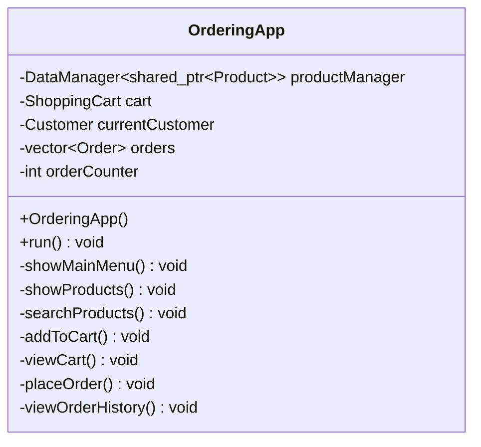

#### Thuộc tính (`private`)

| Tên | Kiểu | Mô tả |
|:---|:---|:---|
| `productManager` | `DataManager<shared_ptr<Product>>` | Quản lý danh sách SP (dùng Template class) |
| `cart` | `ShoppingCart` | Giỏ hàng hiện tại của người dùng |
| `currentCustomer` | `Customer` | Thông tin KH đang sử dụng app |
| `orders` | `vector<Order>` | Lưu tất cả đơn hàng đã đặt trong phiên |
| `orderCounter` | `int` | Bộ đếm để tạo mã đơn tự tăng |

#### Hàm Public

| Hàm | Chú thích |
|:---|:---|
| `OrderingApp()` | Constructor: gọi `FileManager::loadProducts("data/products.txt")` → nạp SP vào `productManager`. Khởi tạo `orderCounter = 0` |
| `run()` | **Vòng lặp chính:** `while(true)` → hiện menu → nhận lựa chọn → gọi hàm tương ứng → thoát khi chọn 0 |

#### Hàm Private

| Hàm | Chú thích |
|:---|:---|
| `showMainMenu()` | In menu: 1.Xem SP, 2.Tim kiem, 3.Them vao gio, 4.Xem gio, 5.Dat hang, 6.Lich su, 0.Thoat |
| `showProducts()` | Duyệt `productManager.getAll()` → gọi `p->displayInfo()` cho từng SP. **Đa hình ở đây**: mỗi loại SP in format riêng |
| `searchProducts()` | Nhận từ khóa từ user → gọi `productManager.filter(lambda)` → in kết quả. Lambda kiểm tra `name.find(keyword)` |
| `addToCart()` | Hiện danh sách SP → user nhập ID + số lượng → gọi `productManager.find(lambda)` tìm SP → kiểm tra tồn kho → `cart.addItem(product, qty)` |
| `viewCart()` | Kiểm tra `cart.isEmpty()` → nếu có hàng: `cout << cart` (operator<<) → hiện tổng tiền |
| `placeOrder()` | Kiểm tra giỏ không trống → nhận thông tin KH (tên, SĐT, email, địa chỉ) → tạo `Customer` → tạo `Order(customer, cart.getItems())` → gọi `order.displayOrder()` hiện hóa đơn → hỏi xác nhận → nếu OK: lưu vào `orders`, gọi `FileManager::saveOrder()`, `cart.clear()` |
| `viewOrderHistory()` | Duyệt `orders` → gọi `cout << order` cho từng đơn. Nếu chưa có đơn nào → in thông báo |

---

## 4. Cấu trúc thư mục

```
oop final project/
├── main.cpp
├── Makefile
├── data/
│   └── products.txt
├── models/
│   ├── Product.h / .cpp
│   ├── FoodProduct.h / .cpp
│   ├── ElectronicsProduct.h / .cpp
│   ├── ClothingProduct.h / .cpp
│   ├── Person.h / .cpp
│   ├── Customer.h / .cpp
│   ├── CartItem.h / .cpp
│   ├── ShoppingCart.h / .cpp
│   └── Order.h / .cpp
├── managers/
│   ├── DataManager.h          (header-only, template)
│   ├── FileManager.h / .cpp
└── app/
    └── OrderingApp.h / .cpp
```

---

## 5. Format file `products.txt`

```
TYPE|ID|NAME|PRICE|STOCK|EXTRA1|EXTRA2
FOOD|F01|Sua tuoi TH|32000|100|2026-12-31|true
FOOD|F02|Banh mi|25000|200|2026-09-15|false
ELECTRONICS|E01|Tai nghe Sony|350000|50|24|Sony
ELECTRONICS|E02|Chuot Logitech|800000|30|12|Logitech
CLOTHING|C01|Ao thun Cotton|150000|100|L|Cotton
CLOTHING|C02|Vay lua|500000|20|M|Silk
```

---

## 6. Verification Plan

### Build & Run
```bash
make clean && make && ./ordering_app
```

### Kiểm tra chức năng
- Load file → hiển thị đúng 3 loại SP với thông tin riêng
- Thêm SP vào giỏ → trùng thì tăng qty
- Xem giỏ → đúng subtotal, tổng tiền
- Đặt hàng → đúng ngày hệ thống, phí ship, tổng thanh toán
- Xem lịch sử → đúng đơn đã đặt

---

## 7. Checklist đối chiếu yêu cầu đề bài Project 1

### Chức năng cốt lõi (Core Functionalities)

| # | Yêu cầu đề bài | Đáp ứng | Thể hiện ở đâu trong plan |
|:---:|:---|:---:|:---|
| 1 | Load product data from a file (.txt) | ✅ | `FileManager::loadProducts()` đọc `data/products.txt` → tạo đối tượng SP |
| 2 | Display the list of products | ✅ | `OrderingApp::showProducts()` → gọi `product->displayInfo()` (đa hình) |
| 3 | Allow users to select products and add them to the shopping cart | ✅ | `OrderingApp::addToCart()` → `ShoppingCart::addItem()` |
| 4 | Users can add items multiple times (tăng số lượng) | ✅ | `ShoppingCart::addItem()` kiểm tra trùng ID → nếu có thì tăng qty |
| 5 | View the shopping cart | ✅ | `OrderingApp::viewCart()` → `cout << cart` (operator<<) |
| 6 | Place an order (nhập thông tin cá nhân + địa chỉ giao hàng) | ✅ | `OrderingApp::placeOrder()` → nhập tên, SĐT, email, địa chỉ → tạo `Customer` |
| 7 | Display and confirm the order | ✅ | `Order::displayOrder()` hiện hóa đơn → hỏi xác nhận Y/N |

### Chi tiết đơn hàng (Order Details Must Include)

| # | Yêu cầu đề bài | Đáp ứng | Thể hiện ở đâu trong plan |
|:---:|:---|:---:|:---|
| 8 | Order date (retrieved from the system's current date) | ✅ | `Order::getSystemDate()` dùng `std::time()` + `std::localtime()` |
| 9 | Customer information | ✅ | `Order::customer` (Customer kế thừa Person: name, phone, email) |
| 10 | Delivery address | ✅ | `Customer::address` — nhập khi đặt hàng |
| 11 | Expected delivery date | ✅ | `Order::calcExpectedDelivery()` = orderDate + 5 ngày |
| 12 | Selected products and corresponding quantities | ✅ | `Order::items` = `vector<CartItem>` (mỗi CartItem có product + quantity) |
| 13 | Shipping fee | ✅ | `Order::calculateShipping()` — tổng > 500k miễn phí, còn lại 30k |
| 14 | Total payment amount | ✅ | `Order::calculateTotal()` = Σ subtotals + shippingFee |

### Yêu cầu chung (General Requirements)

| # | Yêu cầu đề bài | Đáp ứng | Thể hiện ở đâu trong plan |
|:---:|:---|:---:|:---|
| 15 | Apply OOP concepts | ✅ | 13+ class với đầy đủ Encapsulation, Inheritance, Polymorphism, Abstraction |
| 16 | Must use at least one STL container | ✅ | `std::vector`, `std::string`, `std::shared_ptr` — dùng xuyên suốt |
| 17 | Creativity / extra features | ✅ | Template class `DataManager<T>`, tìm kiếm SP, sắp xếp, phân loại 3 loại SP |

### Tiêu chí đánh giá (Evaluation Criteria)

| # | Tiêu chí | Đáp ứng | Chi tiết |
|:---:|:---|:---:|:---|
| 18 | Fulfillment of all required functionalities | ✅ | 14/14 chức năng đều có (bảng trên) |
| 19 | Class design & application of concepts (ch. 2,3,4,5,6) | ✅ | Encapsulation, Constructor/Destructor, Inheritance, Polymorphism, Operator Overloading, Template, STL, Friend, Abstract, Virtual, Override, Static |
| 20 | Use of STL | ✅ | `vector`, `string`, `shared_ptr`, `find_if`, `sort`, `remove_if`, `ifstream`, `ofstream` |
| 21 | Creativity and additional features | ✅ | 3 loại SP khác nhau, Template DataManager, tìm kiếm, phí ship tự động, xuất hóa đơn file |
